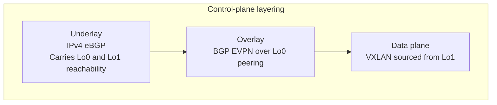
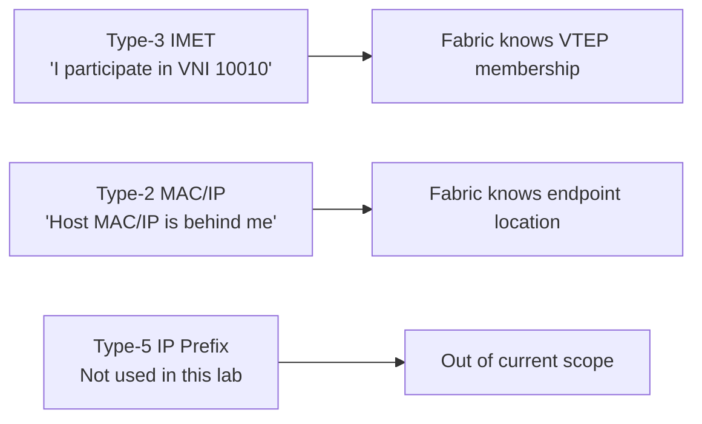
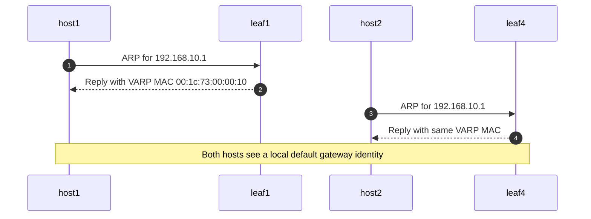
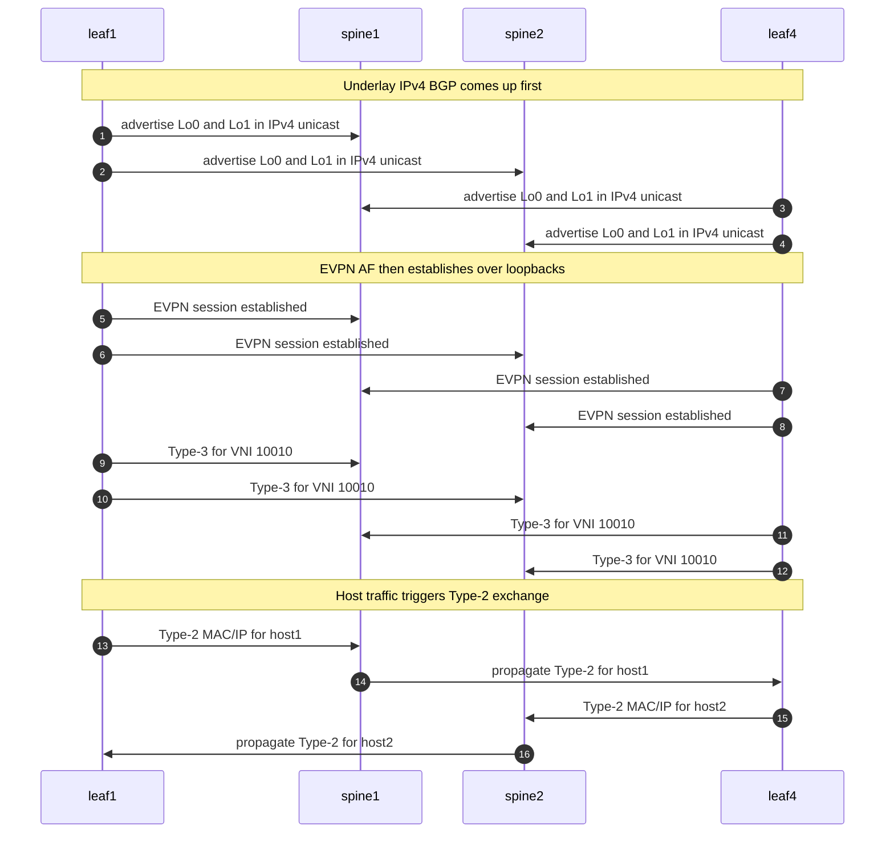
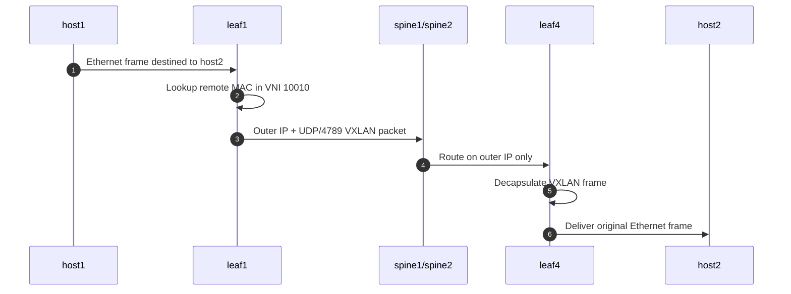

# EVPN Control Plane

This page explains the VXLAN/EVPN technology used in the lab and maps it back to the actual EOS configuration choices in this repository.

## Technology Stack

The fabric is built from three layers that must all work together:

1. Underlay IP reachability
2. EVPN control plane
3. VXLAN encapsulated data plane

If you are debugging, never collapse those layers into one mental model. In this lab:

- Underlay is IPv4 eBGP over routed point-to-point links.
- Overlay is BGP EVPN over loopback peering.
- Data plane is VXLAN sourced from `Loopback1`.

## Why EVPN Instead of Flood-and-Learn VXLAN

Pure data-plane VXLAN flood-and-learn can move frames, but it has bad operational properties:

- remote MAC discovery depends on flooding
- unknown unicast handling is noisier
- control-plane visibility is weaker
- troubleshooting is less deterministic

EVPN fixes that by carrying MAC/IP reachability in BGP. In this lab, the result is:

- deterministic remote MAC/IP learning
- explicit VNI membership signaling
- clear observability through `show bgp evpn ...`
- a control plane you can inspect before user traffic ever crosses the fabric

## Underlay Model

The underlay is simple on purpose:

- every leaf has two routed uplinks, one to each spine
- no L2 adjacency in the fabric core
- no STP dependency in the spine-leaf domain
- no IGP, only eBGP

Each leaf advertises:

- `Loopback0`
- `Loopback1`

Each spine advertises:

- its own `Loopback0`

That is enough for:

- overlay BGP sessions to the spine loopbacks
- VTEP source reachability between leafs



## Overlay Peering Model

The overlay neighbors are:

- `leafX Loopback0 -> spine1 Loopback0`
- `leafX Loopback0 -> spine2 Loopback0`

The relevant EOS pattern is:

```eos
neighbor OVERLAY update-source Loopback0
neighbor OVERLAY ebgp-multihop 3
neighbor OVERLAY send-community extended
address-family evpn
   neighbor OVERLAY activate
```

Why this matters:

- `update-source Loopback0` gives a stable peering identity independent of a physical link
- `ebgp-multihop 3` is required because the BGP peer is not directly connected
- `send-community extended` is required because EVPN depends on extended communities such as route-targets

## What the Spines Do

The spines are not VTEPs. They do two things:

- carry underlay reachability between leafs
- act as EVPN transit/redistribution points between leaf ASNs

Operationally, you can think of them as route-server style control-plane nodes for EVPN. They never terminate tenant VLANs and never originate VXLAN encapsulated traffic on behalf of endpoints.

## What the Leafs Do

Each leaf does all of the edge work:

- learns local MACs on access ports
- participates in VLAN 10 / VNI 10010
- originates EVPN advertisements for learned endpoints
- installs remote MAC/IP entries learned through EVPN
- performs VXLAN encapsulation and decapsulation

On `leaf1` and `leaf4`, the leaf also provides first-hop gateway services through VARP.

## Route Types That Matter In This Lab



### Type-2 MAC/IP Advertisement

This is the route that matters once hosts start sending traffic.

It carries:

- MAC address
- optional IP address
- VNI or Ethernet Tag context
- next-hop/VTEP information

In this lab, a typical flow is:

1. `host1` ARPs or sends any traffic
2. `leaf1` learns the source MAC on `Ethernet10`
3. `leaf1` advertises a Type-2 route for that MAC/IP in VNI `10010`
4. the spines propagate that EVPN information to the other leafs
5. `leaf4` installs a remote entry pointing traffic toward `leaf1`

### Type-3 Inclusive Multicast Ethernet Tag Route

This route signals VNI membership. Even in a unicast-only test, it is fundamental because it tells the fabric which VTEPs participate in a given broadcast domain.

In practical lab terms, Type-3 proves:

- the VNI exists on the advertising leaf
- the remote VTEP is a member of that segment
- BUM handling has enough control-plane context to work

### Type-5 IP Prefix Route

Type-5 is not part of the current service design. This lab is focused on L2VNI extension plus anycast gateway, not distributed IP prefix advertisement for L3VNI services.

That is an important scope boundary: this lab is deep on bridging and host mobility mechanics, not on full tenant routed overlays.

## Anycast Gateway Behavior

`leaf1` and `leaf4` both configure:

- `ip virtual-router mac-address 00:1c:73:00:00:10`
- `interface Vlan10`
- `ip address virtual 192.168.10.1/24`

This gives both access leafs the same default gateway identity for hosts in VLAN 10.

Why it matters:

- `host1` and `host2` can use the same default gateway IP
- the host always ARPs for a local gateway on its attached leaf
- first-hop symmetry stays simple
- the fabric can stretch L2 while still keeping gateway behavior distributed

In this exact lab, only `leaf1` and `leaf4` need the SVI because only those two leaves have host-facing ports. `leaf2` and `leaf3` remain pure transit VTEPs for the L2VNI.



## End-to-End Control-Plane Sequence



## Data Plane Walk

Once the control plane has converged, forwarding from `host1` to `host2` is:

1. `host1` sends an Ethernet frame toward `host2`
2. `leaf1` identifies the destination MAC as remote in VNI `10010`
3. `leaf1` VXLAN-encapsulates the frame using `Vxlan1`
4. the underlay forwards the outer packet to the remote VTEP
5. `leaf4` decapsulates and emits the original frame toward `host2`

The important point is that the spines forward only the outer IP packet. They are not aware of tenant MAC tables.



## Why This Lab Is Good For Deep Validation

Even though there is only one VLAN and one VNI, the lab exercises all of the important mechanics:

- routed underlay establishment
- loopback reachability
- EVPN adjacency formation
- VNI membership advertisement
- MAC/IP export through EVPN
- remote endpoint installation
- VXLAN forwarding
- distributed anycast gateway behavior

That makes it a strong base template for adding:

- more VLANs and VNIs
- L3VNI and tenant VRFs
- Type-5 route exchange
- host mobility tests
- multitenant route-target policy

## EOS Commands That Expose Each Layer

| Layer | Commands |
| --- | --- |
| physical / interface | `show interfaces status`, `show ip interface brief` |
| underlay BGP | `show ip bgp summary`, `show ip route` |
| EVPN sessions | `show bgp evpn summary` |
| Type-3 | `show bgp evpn route-type imet` |
| Type-2 | `show bgp evpn route-type mac-ip` |
| VXLAN state | `show vxlan vtep`, `show interfaces vxlan 1` |
| bridge learning | `show mac address-table`, `show ip arp vlan 10` |

Those commands are enough to correlate the theory on this page with the running lab.
