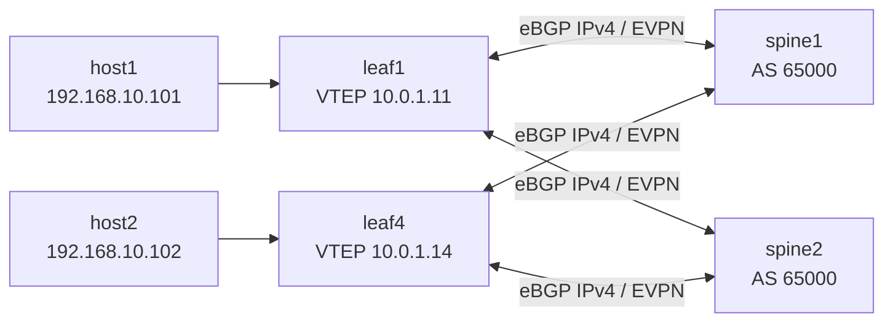

# Fabric Lab

This page describes the exact VXLAN/EVPN fabric built in `topology.fabric.yaml` and the EOS startup configurations under `configs/fabric/`.

## Topology Roles

| Node | Role | Control Plane | Data Plane |
| --- | --- | --- | --- |
| `spine1` | spine | underlay eBGP + EVPN transit | no VTEP function |
| `spine2` | spine | underlay eBGP + EVPN transit | no VTEP function |
| `leaf1` | access/VTEP leaf | underlay eBGP + EVPN | host1 attachment, VARP gateway |
| `leaf2` | transit/VTEP leaf | underlay eBGP + EVPN | L2 VNI membership only |
| `leaf3` | transit/VTEP leaf | underlay eBGP + EVPN | L2 VNI membership only |
| `leaf4` | access/VTEP leaf | underlay eBGP + EVPN | host2 attachment, VARP gateway |
| `host1` | endpoint | static Linux config | traffic source |
| `host2` | endpoint | static Linux config | traffic sink / `iperf3` server |

## Addressing Plan

### Management Network

All devices sit on the containerlab management network `clab-mgmt`.

| Node | Mgmt IP |
| --- | --- |
| `spine1` | `172.20.20.11/24` |
| `spine2` | `172.20.20.12/24` |
| `leaf1` | `172.20.20.21/24` |
| `leaf2` | `172.20.20.22/24` |
| `leaf3` | `172.20.20.23/24` |
| `leaf4` | `172.20.20.24/24` |
| `host1` | `172.20.20.101/24` |
| `host2` | `172.20.20.102/24` |

All EOS devices install `ip route vrf MGMT 0.0.0.0/0 172.20.20.1`.

### Underlay

The underlay uses routed /31 links and eBGP. There is no IGP and no MLAG.

| Link | Leaf Side | Spine Side |
| --- | --- | --- |
| `leaf1 <-> spine1` | `172.16.0.0/31` | `172.16.0.1/31` |
| `leaf1 <-> spine2` | `172.16.0.4/31` | `172.16.0.5/31` |
| `leaf2 <-> spine1` | `172.16.0.8/31` | `172.16.0.9/31` |
| `leaf2 <-> spine2` | `172.16.0.12/31` | `172.16.0.13/31` |
| `leaf3 <-> spine1` | `172.16.0.16/31` | `172.16.0.17/31` |
| `leaf3 <-> spine2` | `172.16.0.20/31` | `172.16.0.21/31` |
| `leaf4 <-> spine1` | `172.16.0.24/31` | `172.16.0.25/31` |
| `leaf4 <-> spine2` | `172.16.0.28/31` | `172.16.0.29/31` |

All routed fabric links use `mtu 9214`. That matters because VXLAN adds overhead and the design intentionally keeps the fabric jumbo-clean.

### Overlay Loopbacks

| Node | Loopback0 | Loopback1 | Purpose |
| --- | --- | --- | --- |
| `spine1` | `10.0.0.1/32` | none | EVPN BGP endpoint |
| `spine2` | `10.0.0.2/32` | none | EVPN BGP endpoint |
| `leaf1` | `10.0.0.11/32` | `10.0.1.11/32` | overlay peering / VTEP source |
| `leaf2` | `10.0.0.12/32` | `10.0.1.12/32` | overlay peering / VTEP source |
| `leaf3` | `10.0.0.13/32` | `10.0.1.13/32` | overlay peering / VTEP source |
| `leaf4` | `10.0.0.14/32` | `10.0.1.14/32` | overlay peering / VTEP source |

The pattern in this lab is deliberate:

- `Loopback0` is the stable BGP peering identity.
- `Loopback1` is the VXLAN source interface on `Vxlan1`.

This keeps the EVPN peering endpoint separate from the VTEP source address, which is a useful mental model when debugging route resolution and encapsulation.

## BGP ASN Plan

| Node | ASN |
| --- | --- |
| `spine1`, `spine2` | `65000` |
| `leaf1` | `65101` |
| `leaf2` | `65102` |
| `leaf3` | `65103` |
| `leaf4` | `65104` |

The underlay is eBGP leaf-to-spine. The overlay is also eBGP leaf-to-spine, with EVPN enabled between leaf `Loopback0` and spine `Loopback0` addresses using `ebgp-multihop 3`.

## Tenant Service Model

The current service is one L2VNI:

| Item | Value |
| --- | --- |
| VLAN | `10` |
| VLAN name | `TENANT10` |
| VNI | `10010` |
| Gateway IP | `192.168.10.1/24` |
| Anycast MAC | `00:1c:73:00:00:10` |
| Route-target | `65000:10010` |

Per-leaf route distinguishers are unique:

| Leaf | RD |
| --- | --- |
| `leaf1` | `10.0.0.11:10010` |
| `leaf2` | `10.0.0.12:10010` |
| `leaf3` | `10.0.0.13:10010` |
| `leaf4` | `10.0.0.14:10010` |

Only `leaf1` and `leaf4` instantiate the `Vlan10` SVI with `ip address virtual 192.168.10.1/24`. `leaf2` and `leaf3` still participate in the MAC-VRF and VNI, but they do not provide gateway function. That is a good choice for lab clarity because it separates "member of the broadcast domain" from "gateway participant."

## Host Placement

| Host | Attachment | Data IP | Default Gateway |
| --- | --- | --- | --- |
| `host1` | `leaf1:Ethernet10` | `192.168.10.101/24` | `192.168.10.1` |
| `host2` | `leaf4:Ethernet10` | `192.168.10.102/24` | `192.168.10.1` |

`host2` runs `iperf3 -s -D`. In the combined topology file, `host1` also starts a repeated `iperf3` client loop after reachability is established. That is useful if you want continuous traffic while observing EVPN, syslog, and dashboards.

## Why This Fabric Works

The forwarding dependency chain is:

1. Underlay BGP must carry reachability to all loopbacks.
2. EVPN sessions must establish between each leaf and both spines.
3. Type-3 routes must advertise VNI membership.
4. Local MAC/IP learning on the access leaf must be exported as Type-2.
5. Remote leafs must install the MAC/IP route and map it to the correct remote VTEP.
6. VXLAN encapsulation must use a reachable source/destination VTEP pair.

If any of those conditions fail, the fabric breaks in a way that is usually easy to classify once you know which stage you are in.

## Key EOS Constructs

The design hinges on a few EOS statements repeated across the configs:

- `service routing protocols model multi-agent`
- `ip routing`
- `interface Vxlan1`
- `vxlan source-interface Loopback1`
- `router bgp <asn>`
- `address-family evpn`
- `vlan 10 ... redistribute learned`
- `ip address virtual 192.168.10.1/24`

The `redistribute learned` statement under the BGP VLAN context is especially important. It is what allows locally learned MAC/IP state in that MAC-VRF to be advertised into EVPN.

## Control-Plane Diagram

## Repository Layout Notes

The fabric definition in `topology.fabric.yaml` is the cleanest source for understanding the core VXLAN/EVPN network. The older `ml-clab-topo.yml` includes additional telemetry and packet-analysis services inline and is still worth reading if you want the original all-in-one operational intent.
