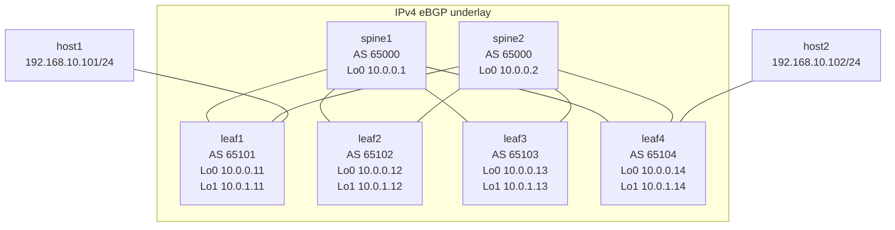

# VXLAN/EVPN Fabric Lab

This site documents the VXLAN/EVPN containerlab built in this repository. It is written for an engineer who already knows BGP, VXLAN, and EVPN, and wants to understand exactly how this lab is implemented, why the design choices matter, and how to validate every layer of the system.

## What This Lab Is

The lab models a small spine-leaf fabric built with Arista cEOS:

- 2 spines in AS `65000`
- 4 leafs in AS `65101` to `65104`
- eBGP underlay on routed /31 links
- EVPN overlay between leaf loopbacks and both spines
- VXLAN data plane with `VLAN 10 -> VNI 10010`
- Anycast default gateway `192.168.10.1/24` using VARP on `leaf1` and `leaf4`
- Two Linux hosts placed on opposite edges of the fabric for real end-to-end traffic tests

The repository currently contains two layout styles:

- `topology.fabric.yaml` + `topology.mgmt.yaml`: the staged split deployment used by `stage_deploy.sh`
- `ml-clab-topo.yml`: an older combined topology that is still useful as a reference because it shows a fuller "all-in-one" lab shape

This documentation treats the split deployment as authoritative for startup workflow, and uses the combined file only as supporting context where it helps explain intent.

## Design Intent

This is not a generic EVPN demo. The implementation is opinionated:

- The underlay is pure routed eBGP, not an IGP.
- The overlay is EVPN over eBGP, not iBGP with route reflectors.
- Spines do not act as VTEPs; they stay out of the data plane.
- Leafs carry both underlay and overlay control-plane roles.
- The service is deliberately small: one stretched L2 segment, one anycast gateway, two endpoints. That keeps the control-plane easy to reason about while still exercising the full VXLAN/EVPN workflow.

## Read This Site In Order

If you want a full understanding of the lab, use this sequence:

1. [Fabric Lab](fabric.md) for topology, addressing, ASNs, and role placement
2. [EVPN Control Plane](evpn-control-plane.md) for the technology deep dive
3. [Deploy & Operations](operations.md) for staged bring-up and day-2 handling
4. [Validation & Testing](validation.md) for command-by-command verification
5. [Troubleshooting](troubleshooting.md) for failure isolation

## Architecture Summary

## Core Service Being Exercised

The service under test is simple but complete:

- Host attachment on `leaf1` and `leaf4`
- Local MAC learning on access ports
- EVPN Type-2 and Type-3 exchange
- VTEP discovery and VXLAN encapsulation
- Anycast default gateway behavior
- East-west traffic transport across the fabric

That combination is enough to validate control-plane convergence, MAC/IP advertisement, BUM replication readiness, and steady-state forwarding.

## Publication Note

The site is already structured for MkDocs Material. Once you are ready to publish through GitHub Pages, use the files under `docs/` as the source of truth and point your Pages workflow at the root `mkdocs.yml`.
