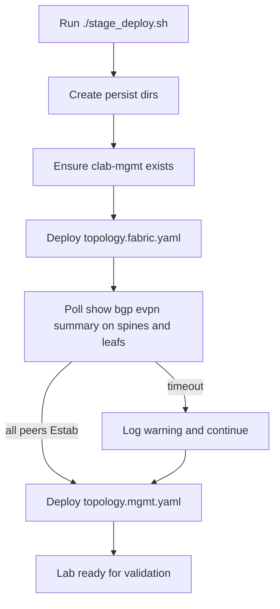
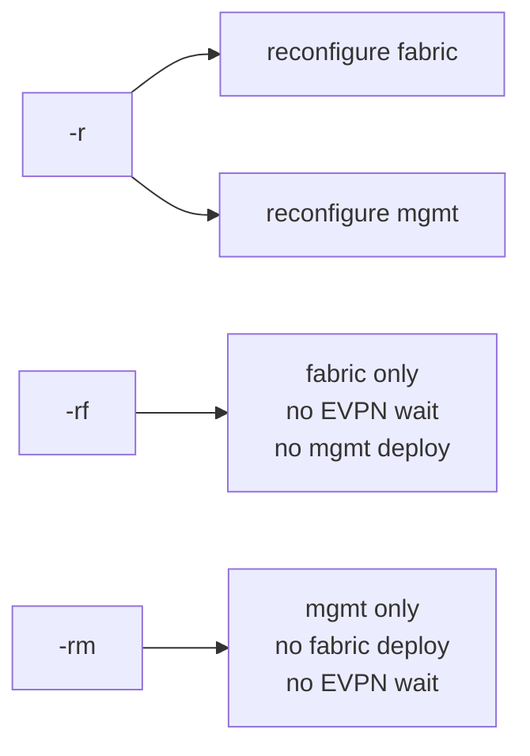

# Deploy & Operations

This page explains how the repository brings the lab up, what the staged workflow is doing, and how to operate the environment once it is running.

## Authoritative Workflow

The staged deployment entrypoint is `stage_deploy.sh`.

Default behavior:

1. ensure persistent directories exist
2. ensure the Docker management network `clab-mgmt` exists
3. deploy the fabric topology
4. poll EVPN status on all spines and leafs
5. deploy the management topology

That split is operationally useful because it prevents the management stack from starting before the network itself is stable.



## Deploy

From the lab root:

```bash
./stage_deploy.sh
```

Explicit form:

```bash
./stage_deploy.sh topology.fabric.yaml topology.mgmt.yaml
```

## Destroy

```bash
./stage_deploy.sh destroy
```

The script destroys the management topology first, then the fabric.

## Reconfigure Paths

The script supports faster partial actions:

```bash
./stage_deploy.sh -r
./stage_deploy.sh -rf
./stage_deploy.sh -rm
```

Meaning:

- `-r`: reconfigure both topologies
- `-rf`: reconfigure only the fabric topology
- `-rm`: reconfigure only the management topology

`-rf` and `-rm` skip the full staged wait logic.



## EVPN Readiness Logic

The deployment script checks these containers:

- `clab-arista-evpn-vxlan-fabric-spine1`
- `clab-arista-evpn-vxlan-fabric-spine2`
- `clab-arista-evpn-vxlan-fabric-leaf1`
- `clab-arista-evpn-vxlan-fabric-leaf2`
- `clab-arista-evpn-vxlan-fabric-leaf3`
- `clab-arista-evpn-vxlan-fabric-leaf4`

For each node it runs:

```bash
Cli -c "show bgp evpn summary"
```

The lab is considered ready when all EVPN neighbors on all those nodes are in `Estab` or `Established` state.

That is a reasonable gating signal for this lab because EVPN establishment depends on:

- interface state
- underlay reachability
- loopback reachability
- overlay BGP health

## Useful Environment Variables

| Variable | Meaning | Default |
| --- | --- | --- |
| `MAX_WAIT` | EVPN convergence timeout in seconds | `300` |
| `POLL_INT` | polling interval in seconds | `10` |
| `NO_COLOR` | disable color output | `0` |
| `FABRIC_LAB_NAME` | override fabric lab name | `arista-evpn-vxlan-fabric` |
| `MGMT_LAB_NAME` | override mgmt lab name | `arista-evpn-vxlan-mgmt` |

Example:

```bash
MAX_WAIT=600 POLL_INT=5 ./stage_deploy.sh
```

## Operational Access

### EOS CLI

```bash
docker exec -it clab-arista-evpn-vxlan-fabric-leaf1 Cli
docker exec -it clab-arista-evpn-vxlan-fabric-spine1 Cli
```

### Linux Hosts

```bash
docker exec -it clab-arista-evpn-vxlan-fabric-host1 bash
docker exec -it clab-arista-evpn-vxlan-fabric-host2 bash
```

### Management Services

| Service | Access |
| --- | --- |
| Grafana | `http://localhost:3000` |
| Mimir | `http://localhost:9009` |
| Loki | `http://localhost:3100` |
| gNMIc exporter | `http://localhost:9804/metrics` |
| Alloy debug UI | `http://localhost:12345` |

## Management Stack Notes

The split management topology currently contains:

- `gnmic`
- `mimir`
- `grafana`
- `alloy`
- `loki`
- `redis`

The repository also includes an older combined topology that has additional inline services and slightly different packaging. When operating the split deployment, treat `topology.mgmt.yaml` as the source of truth.

## Recommended Day-2 Workflow

When you are experimenting with EVPN/VXLAN behavior:

1. deploy the lab with the staged script
2. verify underlay and overlay convergence
3. test host-to-host reachability
4. inspect EVPN route tables before and after traffic
5. make one configuration change at a time
6. use `-rf` when iterating only on the network fabric

That keeps the failure domain small and makes regression analysis much easier.

## Documentation Publication

The MkDocs source lives under `docs/`. The root `mkdocs.yml` should be used as the site configuration for local preview and later GitHub Pages publishing.
