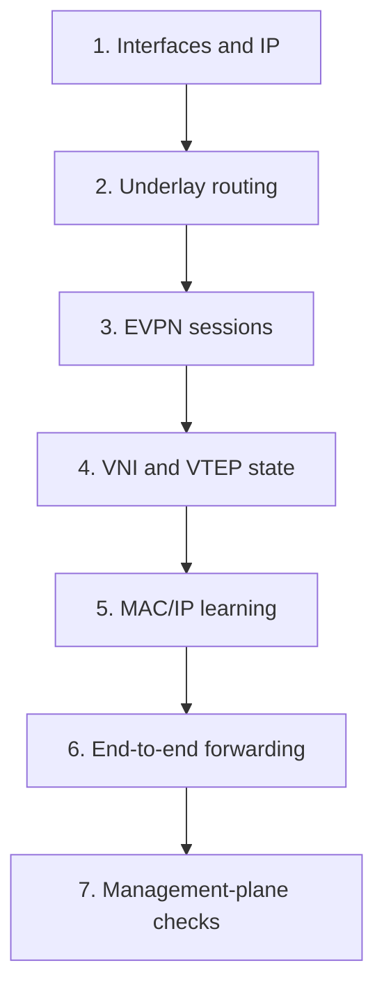
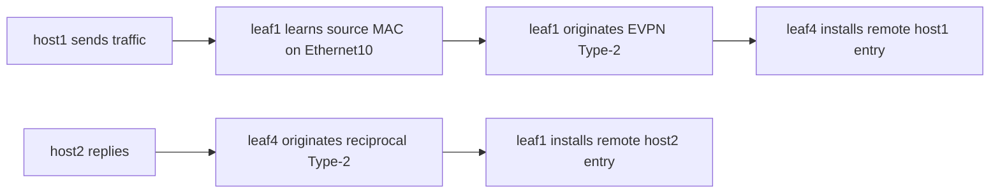
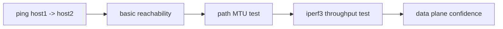

# Validation & Testing

This page is the practical runbook for proving the lab works. The sequence is written to narrow failures quickly by moving from the bottom of the stack upward.

## Validation Strategy

Treat the fabric as five layers:

1. interfaces and addressing
2. underlay routing
3. EVPN control plane
4. VXLAN/VTEP state
5. endpoint forwarding

Do not skip directly to `ping` and assume it tells you enough. It does not.



## 1. Interface and IP Sanity

### On a leaf

```bash
docker exec clab-arista-evpn-vxlan-fabric-leaf1 Cli -c "show interfaces status"
docker exec clab-arista-evpn-vxlan-fabric-leaf1 Cli -c "show ip interface brief"
```

What you want:

- `Ethernet1` and `Ethernet2` up/up
- `Loopback0` and `Loopback1` present
- `Ethernet10` up/up when the host is attached
- `Vlan10` present on `leaf1` and `leaf4`

### On a host

```bash
docker exec clab-arista-evpn-vxlan-fabric-host1 ip addr show dev eth1
docker exec clab-arista-evpn-vxlan-fabric-host1 ip route
```

What you want:

- `192.168.10.101/24` on `host1`
- default route via `192.168.10.1`

## 2. Underlay Reachability

### Check BGP IPv4 unicast on leaf1

```bash
docker exec clab-arista-evpn-vxlan-fabric-leaf1 Cli -c "show ip bgp summary"
docker exec clab-arista-evpn-vxlan-fabric-leaf1 Cli -c "show ip route 10.0.1.14"
docker exec clab-arista-evpn-vxlan-fabric-leaf1 Cli -c "show ip route 10.0.0.2"
```

What you want:

- both underlay neighbors established
- reachability to remote `Loopback0`
- reachability to remote `Loopback1`

### Check BGP IPv4 unicast on a spine

```bash
docker exec clab-arista-evpn-vxlan-fabric-spine1 Cli -c "show ip bgp summary"
docker exec clab-arista-evpn-vxlan-fabric-spine1 Cli -c "show ip route 10.0.1.11"
docker exec clab-arista-evpn-vxlan-fabric-spine1 Cli -c "show ip route 10.0.1.14"
```

You should see all four leaf loopback pairs reachable through the underlay.

## 3. EVPN Session Health

### Per-node summary

```bash
docker exec clab-arista-evpn-vxlan-fabric-leaf1 Cli -c "show bgp evpn summary"
docker exec clab-arista-evpn-vxlan-fabric-leaf4 Cli -c "show bgp evpn summary"
docker exec clab-arista-evpn-vxlan-fabric-spine1 Cli -c "show bgp evpn summary"
```

What you want:

- `leaf1` has EVPN sessions to `10.0.0.1` and `10.0.0.2`
- `leaf4` has EVPN sessions to `10.0.0.1` and `10.0.0.2`
- each spine has EVPN sessions to all four leaf loopbacks

## 4. VNI Membership and VTEP Discovery

### IMET / Type-3

```bash
docker exec clab-arista-evpn-vxlan-fabric-leaf1 Cli -c "show bgp evpn route-type imet"
docker exec clab-arista-evpn-vxlan-fabric-leaf4 Cli -c "show bgp evpn route-type imet"
```

What you want:

- entries for all VTEPs participating in `VNI 10010`
- local and remote membership visible

### VXLAN operational state

```bash
docker exec clab-arista-evpn-vxlan-fabric-leaf1 Cli -c "show interfaces vxlan 1"
docker exec clab-arista-evpn-vxlan-fabric-leaf1 Cli -c "show vxlan vtep"
```

What you want:

- `Vxlan1` operational
- remote VTEPs learned

## 5. Local Endpoint Learning

Generate a little traffic first:

```bash
docker exec clab-arista-evpn-vxlan-fabric-host1 ping -c 3 192.168.10.102
```

Then inspect the local edge:

```bash
docker exec clab-arista-evpn-vxlan-fabric-leaf1 Cli -c "show mac address-table dynamic"
docker exec clab-arista-evpn-vxlan-fabric-leaf1 Cli -c "show ip arp vlan 10"
```

What you want on `leaf1`:

- `host1` MAC learned locally on `Ethernet10`
- `host2` MAC learned remotely through VXLAN/EVPN
- ARP entries for both host IPs once traffic has occurred



## 6. EVPN Type-2 MAC/IP Advertisement

```bash
docker exec clab-arista-evpn-vxlan-fabric-leaf1 Cli -c "show bgp evpn route-type mac-ip"
docker exec clab-arista-evpn-vxlan-fabric-leaf4 Cli -c "show bgp evpn route-type mac-ip"
```

What you want:

- each access leaf advertises its directly attached host
- the remote host appears as an EVPN-learned entry
- the route is tied to `VNI 10010`

This is the best single command for proving that endpoint reachability has been exported into the EVPN control plane.

## 7. End-to-End Forwarding

### Reachability

```bash
docker exec clab-arista-evpn-vxlan-fabric-host1 ping -c 5 192.168.10.102
docker exec clab-arista-evpn-vxlan-fabric-host2 ping -c 5 192.168.10.101
```

### Path MTU sanity

```bash
docker exec clab-arista-evpn-vxlan-fabric-host1 ping -M do -s 1472 -c 3 192.168.10.102
```

If this fails, inspect MTU handling end to end before blaming EVPN.

### Throughput

```bash
docker exec clab-arista-evpn-vxlan-fabric-host1 iperf3 -c 192.168.10.102 -P 4 -t 20
```

This confirms the data plane is stable under more than a single ICMP flow.



## 8. Gateway Validation

On `host1`:

```bash
docker exec clab-arista-evpn-vxlan-fabric-host1 ip neigh show
```

On `leaf1`:

```bash
docker exec clab-arista-evpn-vxlan-fabric-leaf1 Cli -c "show ip virtual-router"
docker exec clab-arista-evpn-vxlan-fabric-leaf1 Cli -c "show running-config section virtual-router"
```

What you want:

- the host resolves `192.168.10.1` to the shared VARP MAC
- `leaf1` and `leaf4` both present the same anycast identity

## 9. Optional Packet Capture

On `host1`:

```bash
docker exec clab-arista-evpn-vxlan-fabric-host1 tcpdump -ni eth1
```

If you want to capture on the VTEP itself, run a shell inside the leaf container and capture the Linux interface that backs the cEOS link, but for most validation the EOS show commands are a cleaner source of truth.

## 10. Management-Plane Validation

### gNMIc exporter

```bash
curl -s http://localhost:9804/metrics | head
```

### Mimir health

```bash
curl -s http://localhost:9009/ready
```

### Loki readiness

```bash
curl -s http://localhost:3100/ready
```

### Grafana

Open `http://localhost:3000` and validate that datasources and dashboards load.

## Suggested Test Matrix

Use this matrix when extending the lab:

| Test | Command | Expected Result |
| --- | --- | --- |
| underlay BGP | `show ip bgp summary` | all routed neighbors established |
| overlay BGP | `show bgp evpn summary` | all EVPN peers established |
| IMET | `show bgp evpn route-type imet` | all VTEP members visible |
| MAC/IP | `show bgp evpn route-type mac-ip` | local and remote host entries visible |
| VTEP state | `show vxlan vtep` | remote VTEPs present |
| anycast gateway | `ip neigh show` on host | gateway MAC matches VARP MAC |
| user traffic | `ping`, `iperf3` | clean end-to-end forwarding |

## What To Check Before Extending The Design

Before adding more VLANs, VRFs, or leafs, make sure the current single-service fabric is clean in all five layers. If the base lab is not deterministic, scaling it will only multiply ambiguity.
